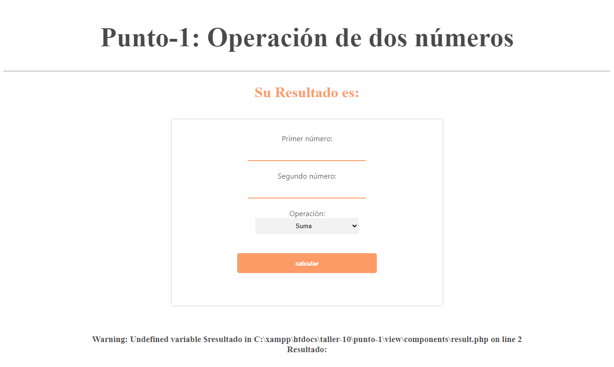
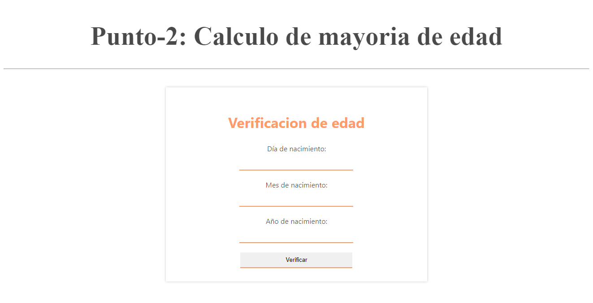
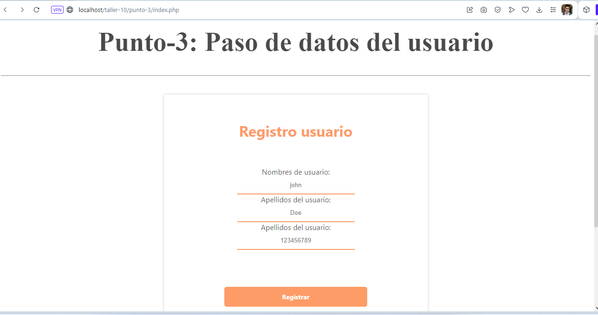
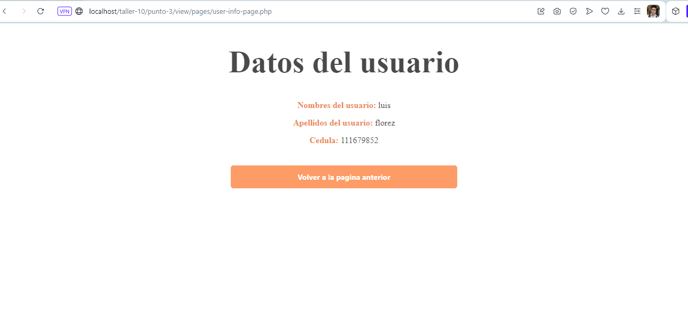
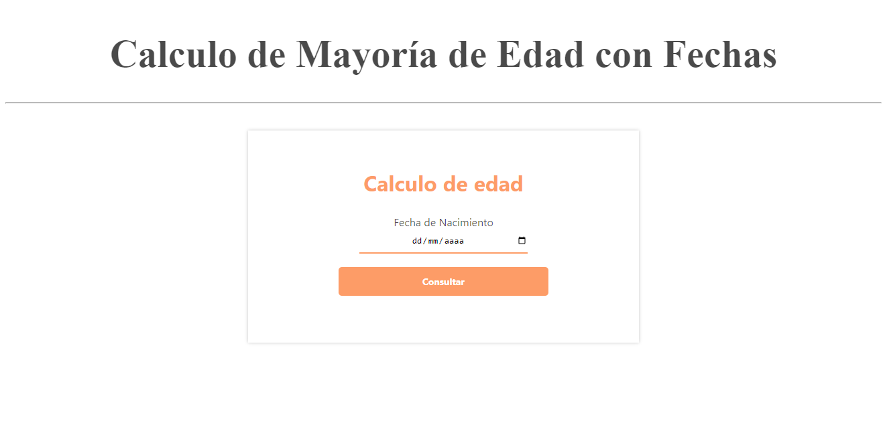
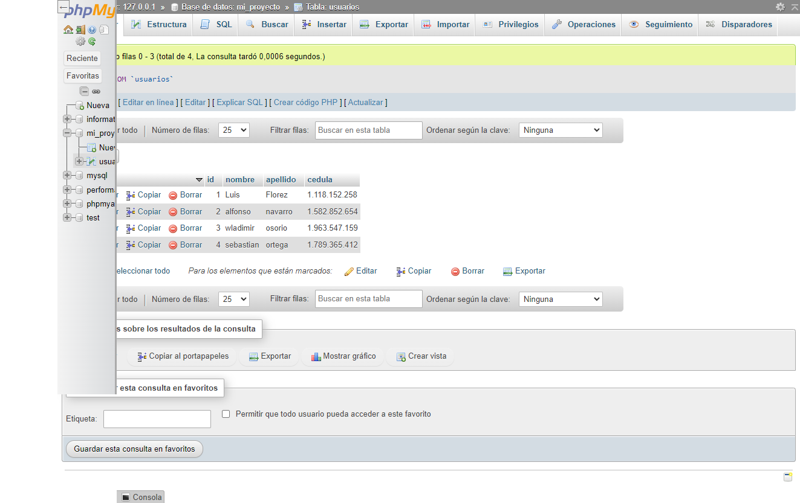
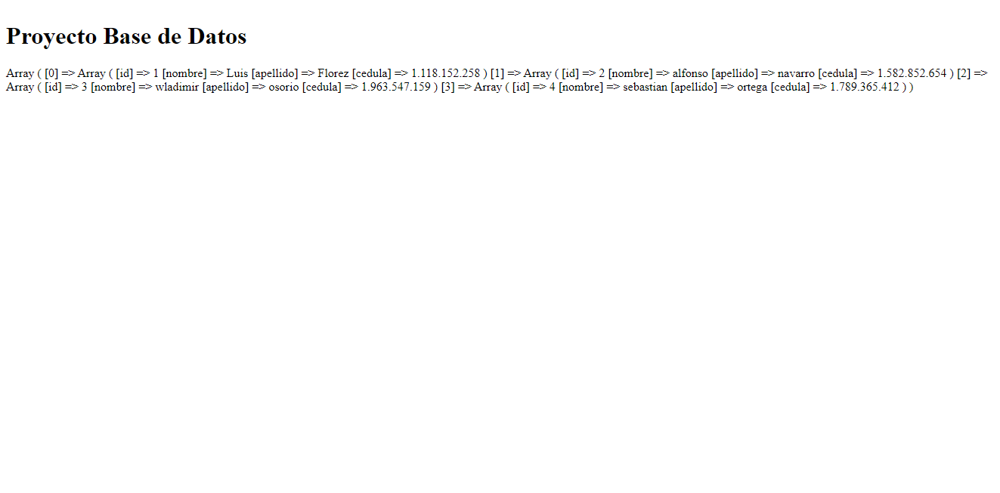
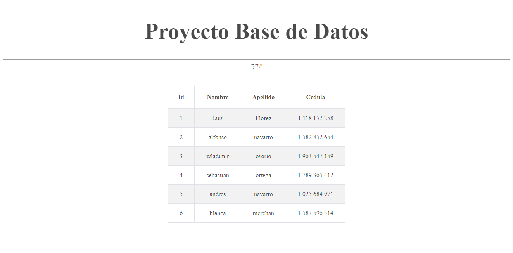

<h1>Taller 10 luis Florez</h1>

<h2>Informacion</h2>

Curso: Full Stack Basico - Grupo 1

Profesor: Cristian Patiño

<h2>Punto 1: </h2>
<h3> Operacion de dos numeros </h3>

<h2>Punto 2: </h2>
<h3> Calculo de Mayoría de Edad</h3>

<h2>Punto 3: </h2>
<h3>   Paso de datos del usuario</h3>

<h2>Punto 4: </h2>
<h3>  Calculo de Mayoría de Edad con Fechas</h3>

<h2>Punto 5-6-7:</h2>
<h3> 5 - Base de datos</h3>

<h3> 6 - Conexion </h3>

<h3> 7 - Muestra de datos en pantalla </h3>

